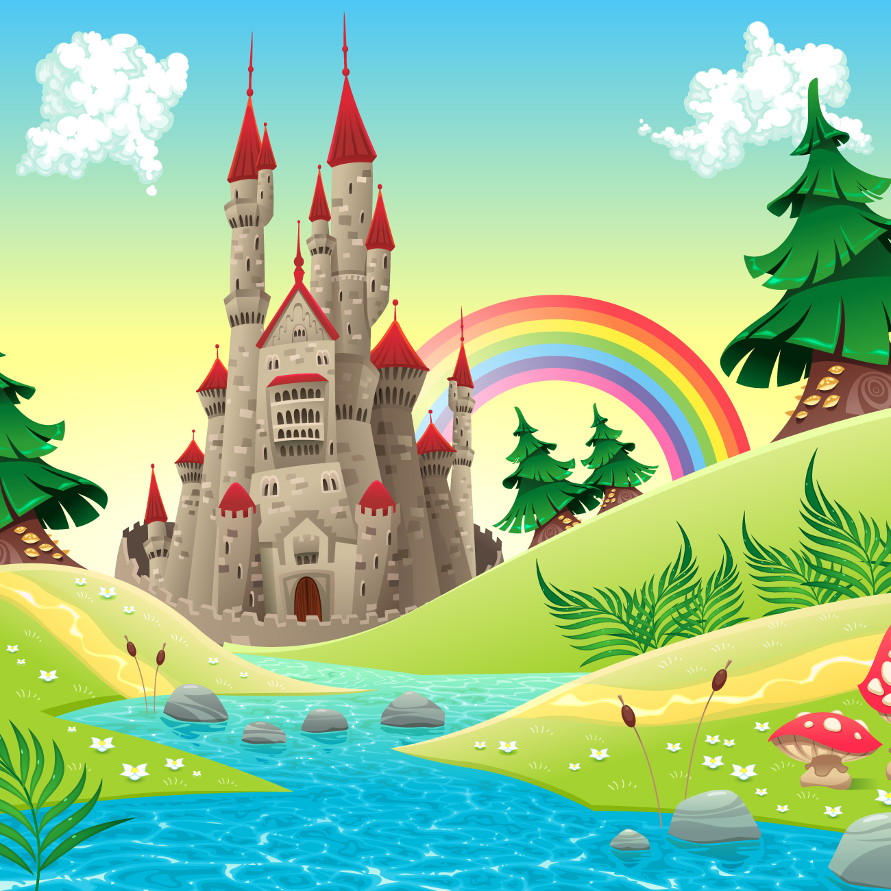

<!-- ### Hi there 👋 -->
## IT IS BEAUTIFUL FOR YOU TO SEE IT.

	

<h1 style="color:purple">When you have eliminated the impossible,whatever remains ,however improbable,must be the truth.</h1>

### ABOUT ME
- 🔭 前端开发工程师，某三线城市互联网公司，三年开发经验...
<!-- -  -->
- 🌸 日常喜欢旅游...
<!-- - 🔭 I’m currently working on  -->
- 🌱 I’m currently learning 构建工具:Webpack ...
<!-- -  -->
- 👯 I’m looking to collaborate on GUESS ...
<!-- -  -->
- 🤔 I’m looking for help with React ...
<!-- -  -->
- 💬 Ask me about 掘金:逆水先生
<!-- -  -->
- 📫 How to reach me: LET I FIND YOU ...
<!-- -  -->
- 😄 Pronouns: ...
<!-- -  -->
- ⚡ Fun fact: ...

### LANGUAGES AND TOOLS

	
	
	
	
	
	
	
	
	
	
	
	
	
	
	
	
	
	
	
	
	
	
	
	

### HOW TO REACH ME

<table>
    <tr align="center">
        <td></td>
        <td></td>
        <td></td>
    </tr>
    <tr>
        <td><a href="https://juejin.cn/user/2784392994882045" target="_blank">掘金: 逆水先生</a></td>
        <td><a href=https://blog.csdn.net/qq_43710627?spm=1000.2115.3001.5343" target="_blank">CSDN: Coder GXX</a></td>
        <td><a href="https://luckywishes.github.io/" target="_blank">PERSON：XGG&Blog</a></td>
    </tr>
</table>

<!--
**xyhabc/xyhabc** is a ✨ _special_ ✨ repository because its `README.md` (this file) appears on your GitHub profile.

Here are some ideas to get you started:

- 🔭 I’m currently working on ...
- 🌱 I’m currently learning ...
- 👯 I’m looking to collaborate on ...
- 🤔 I’m looking for help with ...
- 💬 Ask me about ...
- 📫 How to reach me: ...
- 😄 Pronouns: ...
- ⚡ Fun fact: ...
-->
